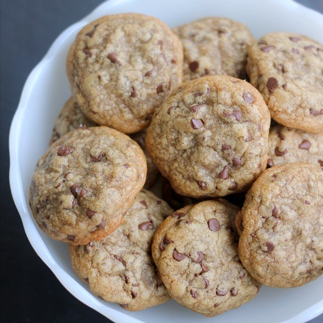

# Chocolate Chip Cookies

| Prep Time        | Cook Time           | Total Time  |
| ------------- |:-------------:| -----:|
| 5 min     | 12 min | 17 min |

## About

This recipe from [Baker Bettie's chocolate chip cookie recipe](http://bakerbettie.com/easy-chocolate-chip-cookies/). The recipe makes a **12-18** cookies. 

Enjoy - please let me know if you come up with any new variations. I'd love to hear what you come up with!

## Ingredients

* 1 stick (1/2 cup) softened butter salted or unsalted, at room temperature (required)
* 3/4 cup light or dark brown sugar ( required, do not use granulated white sugar)
1 large egg, at room temperature (required)
* 1 tsp vanilla extract (optional, but recommended)
* 1/4 tsp salt, or large pinch (optional, but recommended)
* 1 cup plus 1/4 cup flour being careful not to pack down when measuring (required)
* 1 cup chocolate chips (any kind your prefer or have on hand)

## Instructions:

Preheat oven to 350ºF.

* In the bowl of a stand mixer fitted with the paddle attachment (or a large bowl with a hand mixer) cream together the butter and sugar until fluffy. (NOTE: if you do not have a mixer you can do this with a wooden spoon. Beat together the butter and sugar until completely combined and fluffy. This will take some time.)

* Add the egg and vanilla (if using) to the butter/sugar mixture and mix until incorporated.

* Stir in the flour, salt (if using), and the chocolate chips just until combined. Do not mix for a long time after adding the flour, it will create cookies that are too tough or cakey.

* Scoop into mounds about 2 TBSP each onto ungreased cookie sheets (you can use a silpat or parchment paper to line your sheets). Do not put more than 9 cookies per sheet.

* Bake at 350ºF until just set on the edges and middle still looks a little bit undercooked. About 8-12 minutes. (these cookies do not brown as much as other cookies because of the lack of baking soda or baking powder.)

* Allow to cool on the baking sheets for 5 minutes before removing. Cookies will continue to cook on the sheets for a few minutes.